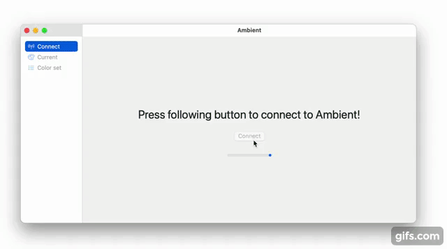

# Ambient Swift
This is a client application for the [ESP32 Bluetooth LED controller](https://github.com/31337Ghost/ambient).

- Compiles for both macOS and iOS. 
- Uses SwiftUI without any external libraries.
